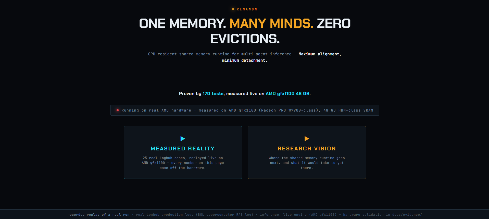
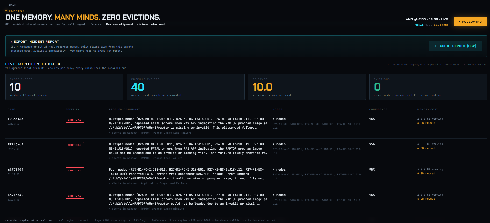
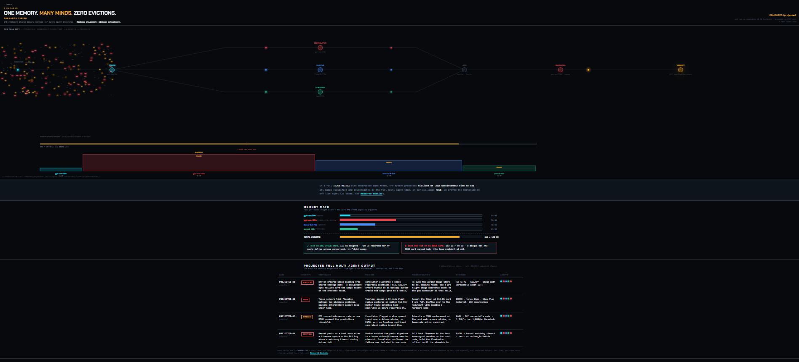

<div align="center">

# REMANON

### One memory. Many minds. Zero evictions.

**A GPU-resident shared-memory runtime for multi-agent, multi-model AI inference.**

*Maximum alignment, minimum detachment.*

[](https://nevineakf.github.io/remanon/)
[](#engineering-discipline)
[](LICENSE)

**[🌐 Live Demo](https://nevineakf.github.io/remanon/)  ·  [📄 Master Reference](docs/Remanon_Master_Reference.pdf)  ·  [📊 Presentation](docs/Remanon_Presentation.pdf)**

<br>

*AMD Developer Hackathon: ACT II · Track 3 (Unicorn) · Solo build by Nevine Fakhreddin*

</div>

---

<div align="center">



</div>

---

## The problem

When several AI agents investigate the same problem, they share most of the same information: the same incident, the same logs, the same body of evidence. Yet in every inference stack deployed today, each agent rebuilds that shared context from scratch inside GPU memory, paying again for work another agent finished moments earlier.

Research from the Stanford Digital Economy Lab found that re-sent context accounts for **62% of agent inference bills**. The waste compounds in three directions at once:

- **Time** — every agent recomputes a prefill of context that was already computed.
- **Memory** — high-bandwidth memory fills with duplicate copies of an identical context.
- **Capacity** — that duplication is what makes a multi-model team overflow the card and fail to load at all.

On a fixed memory budget, duplication is not an inefficiency to tune away later. It is the wall that decides whether a multi-agent team can run in the first place.

---

## The solution

Remanon materializes the shared context **once per distinct model**, pins it in high-bandwidth memory so it can never be evicted under any pressure, and lets every agent of that model read the same resident copy while paying only for its own small private delta.

This is not a caching optimization in new language. It is a **cross-engine memory arbiter with a contract-enforced residency guarantee**, filling a role no component in the current inference stack occupies.

| | Without Remanon | With Remanon |
|---|---|---|
| Shared context | Each agent builds its own copy | Materialized once per model, shared |
| Same-model agents | Rebuild the same cache separately | Read one pinned master |
| Under memory pressure | Blocks are silently evicted | The pinned master is never evicted |
| Multi-model team | Overflows the card and fails | Fits, because duplication is removed |
| Prefill cost | One prefill per agent | One prefill per distinct model |

---

## Why this is not vLLM prefix caching

The difference is one of **contract, not mechanism** — the first question any informed reviewer will raise.

| | vLLM automatic prefix cache | Remanon |
|---|---|---|
| Nature | Opportunistic, best-effort | Contract-enforced guarantee |
| Eviction | May silently evict any block under pressure | A pinned block cannot be evicted while any lease is live |
| Scope | Lives inside one engine | A cross-engine arbiter over multiple engines sharing one memory pool |
| Admission | No awareness of other work | New work is budgeted around the pinned master |

**Three guarantees, enforced by contract and proven by tests:**

- **Pinned-never-evicted** — a pinned master is never evicted, for any reason, under any pressure. No eviction path exists for a leased block; verified at the transport layer.
- **One-prefill-per-model** — the master is prefilled at most once per distinct model, ever. Ten concurrent leases for one model produce exactly one measured prefill.
- **Read-through-master** — every generation request carries the pinned master context as its byte-identical system prefix; two agents on one model share that prefix on the wire. Verified at the transport layer.

### In depth: why the distinction is decisive

A reviewer who knows the field deserves the full argument, not a table. The gap between opportunistic caching and guaranteed residency is not cosmetic. It is the difference between a system that *usually* saves and a system that *provably* saves, and it splits into three concrete failures that prefix caching cannot escape.

**1. Opportunistic reuse breaks under exactly the pressure that matters.** A prefix cache reuses a key-value block only if that block still happens to be resident. But high-bandwidth memory is finite, and when it fills, the engine must free space for incoming work. It does so by evicting older cache blocks — and it evicts silently, with no signal to the caller. Picture the real sequence: the first agent builds the shared context block; memory pressure rises as more agents and requests arrive; the engine quietly evicts that shared block to make room; the second agent arrives expecting to reuse it, finds nothing, and rebuilds it from scratch. You paid the prefill twice, precisely when the system was busiest and could least afford it. Prefix caching is a parking lot open to the public: you park if a space is free, but nothing stops your car from being towed when the lot gets crowded. Remanon is a space reserved in your name — pinned, guaranteed, immune to pressure for the lifetime of the lease. This is why the property is stated as a contract, not a hope: **no code path exists that can evict a pinned master**, so the guarantee holds by construction rather than by luck.

**2. Prefix caching lives inside one engine; a four-model team needs an authority across engines.** vLLM's cache reasons only about the single engine it runs in. It has no view of any other engine and no way to coordinate memory with one. But Remanon's team runs four distinct models — gpt-oss-20b, gpt-oss-120b, Llama 3.3 70B, Qwen3-32B — each served by its own separate engine, each engine an isolated island that cannot see or share memory with the others. Coordinating one shared memory pool across those islands is structurally impossible for a per-engine cache, no matter how good it is. Remanon is the cross-engine arbiter that sits above all of them: it knows what each model holds, where the shared master lives, and who is reading it, and it governs the single HBM pool as one managed resource. This is not a better version of prefix caching. It is a layer prefix caching cannot reach.

**3. Opportunistic eviction is blind; Remanon's admission is budgeted.** A prefix cache makes only moment-to-moment decisions — space free, store; space tight, evict — with no awareness of the workload as a whole. Remanon instead budgets every admission around the pinned master: the shared block is reserved and protected, and each agent's small private delta is admitted against the remaining bytes by an integer-exact accounting law. Pressure is absorbed by the disposable deltas, never by the shared foundation. The scarce resource is governed deliberately, not surrendered to chance.

The one-line version, and the sentence to remember: **prefix caching hopes; Remanon guarantees — and it does so across engines, not inside one.** The guarantee is not a slogan. It is measured: ten concurrent requests for one model produce exactly one prefill, observed at the HTTP transport layer, and held stable by 170 automated tests.

---

## Measured on AMD — every number labelled

Captured live on AMD gfx1100 (48 GB) serving gpt-oss-20b under vLLM. Nothing fabricated, nothing simulated.

| Evidence | Value | Provenance |
|---|---|---|
| GPU / architecture | AMD gfx1100 · 48 GB VRAM | MEASURED |
| Model weights resident | 14.3 GiB | MEASURED |
| Key-value cache available | 26.67 GiB · 582,576 tokens | MEASURED |
| VRAM used while serving | 46.02 GB of 48 GB | MEASURED |
| Shared-context reuse | cold 10.635 s → warm 1.839 s = **5.8× faster** | MEASURED |
| Engine prefix-cache hit rate | 66.3% | MEASURED |
| Prefills avoided across the run | 110 | MEASURED |
| Evictions of a pinned master | 0 | MEASURED |

Two independent signals confirm the same fact: our own timed **5.8×** and the engine's **66.3%** hit-rate counter. The mechanism is measured, not asserted, and the logic beneath it is proven by **170 automated tests**, including transport-layer contract tests.

<div align="center">



</div>

---

## Two versions, honestly separated

The allocated hardware was a 48 GB gfx1100, not the 192 GB MI300X the design targets. Rather than obscure that gap, the project presents two clearly labelled views of the same system.

**MEASURED REALITY** — what actually ran: one model served live on AMD gfx1100, a real flood of production logs turned into real classified verdicts, with a downloadable incident ledger. On 48 GB the full four-model team does not fit, and that impossibility is itself the proof of the capacity thesis.

**RESEARCH VISION** — the full system: five agents across four models, one pinned master each, resident together on 192 GB HBM3. Grounded in the measured mechanism, the 170 tests, and a transparent arithmetic projection of the memory budget. Labelled COMPUTED throughout, with an interactive memory allocator that computes in real arithmetic exactly when a team fits an 80 GB card, when it fits 192 GB, and when it overflows.

<div align="center">



</div>

---

## The agents — five minds, four models

An incident-investigation team, each agent a distinct role on the same shared context.

| Agent | Role | Model |
|---|---|---|
| **Triage** | Classifies severity, opens the case | gpt-oss-20b |
| **Correlator** | Builds the causal hypothesis | gpt-oss-120b |
| **Hunter** | Pulls hard evidence from the store | Llama 3.3 70B |
| **Topology** | Maps the blast radius | Qwen3-32B |
| **Reporter** | Synthesizes the final verdict | gpt-oss-120b |

Correlator and Reporter run on the same model, so they share a single pinned master: two agents, one resident copy. The sharing unit is the **distinct model**, never the family.

---

## Architecture — three bands, two contracts

```
┌────────────────────────────────────────────────────────────┐
│ BAND A · APPLICATION            swappable per DOMAIN         │
│   Dashboard · Orchestrator · 5 Agents · Adapter · Dataplane │
├────────────────────────────────────────────────────────────┤
│      CONTRACT A · Runtime Memory API   (Remanon's own)      │
│                materialize / lease / generate               │
├────────────────────────────────────────────────────────────┤
│ BAND B · CORE                   the product · INVARIANT      │
│   Engine Registry · Materializer · Residency Manager        │
│   Budgeter · Metrics                                        │
├────────────────────────────────────────────────────────────┤
│      CONTRACT B · OpenAI-compatible engine API (vLLM)       │
├────────────────────────────────────────────────────────────┤
│ BAND C · SUBSTRATE              swappable per ENGINE/HW      │
│   vLLM engines · ROCm · AMD Instinct HBM3                   │
└────────────────────────────────────────────────────────────┘
```

Band A swaps per domain, Band C swaps per engine and hardware, and Band B — the core — never changes. The memory arbiter neither knows nor cares what the agents investigate. Today it powers incident analysis; the identical core plugs into any multi-agent, multi-model workload.

---

## Why AMD is the hero

Remanon's competitive argument is **capacity, not speed**. It rests on the absolute difference between a multi-agent team fitting, or not fitting, in one memory pool.

- **Small memory → the idea fails.** Four models require roughly 162 GB and overflow an 80 GB card. The team cannot even load.
- **Large memory → the idea works.** The 192 GB HBM3 of the AMD Instinct MI300X is the enabling substrate that lets the impossible fit.

This is AMD's own strategic story told back to AMD: memory-rich, open-model, inference-bound workloads are exactly where the MI300X wins. Remanon is a workload whose entire feasibility is decided by the memory only AMD brings.

---

## The market validated the problem

The problem Remanon attacks is a live, funded market. Memory-runtime startups on adjacent claims have raised significant venture capital this year — **Engram** ($98M at a $600M valuation, backed by Sequoia, Kleiner Perkins, and Andrej Karpathy) on learned memory baked into weights, and **Callosum** ($10.25M) on multi-model orchestration. Remanon's differentiator over both is singular: a guaranteed, cross-engine residency contract that opportunistic prefix caches cannot provide. Where others optimize by chance, Remanon guarantees by construction.

---

## Run it (GPU-free, one command)

```bash
docker build -t remanon .
docker run -p 8080:8080 remanon
```

Open **http://localhost:8080**. The container ingests real Loghub sample logs (HDFS, BGL, Thunderbird, Spark, Hadoop — real files, never synthetic), then replays them through the full agent pipeline against an in-process mock engine. Zero GPU required.

### Local development (no GPU)

```bash
uv venv
uv pip install -e ".[dev]"
pytest          # 170 tests
ruff check .
```

### Reproduce the recording

```bash
# default: first N cases
python -m app.orchestrator.run_demo --record

# diverse selection: one case per distinct failure signature, spread across time
python -m app.orchestrator.run_demo --record --select diverse --max-cases 25
```

The recorded July run predates the read-through-master change; the new invariant is enforced and transport-verified by the contract tests.

<a name="engineering-discipline"></a>

---

## Engineering discipline

Built solo, with big-tech gates from day one.

- **170 automated tests** — contract, concurrency, and cross-layer invariants
- **0 leaked leases** across every full run — accounting closes exactly
- **1 prefill per model** under 10 concurrent requests, transport-measured
- CI and pre-commit on every commit, one pinned toolchain
- No code path exists that can evict a pinned master — correctness by construction, not by policy

---

## Documentation

- **[📄 Master Reference Document](docs/Remanon_Master_Reference.pdf)** — the complete reference: problem, solution, originality, architecture, measured evidence, and answers to the hardest questions a technical panel can ask.
- **[📊 Presentation](docs/Remanon_Presentation.pdf)** — the full 18-slide deck.
- **[🌐 Live Demo](https://nevineakf.github.io/remanon/)** — the deployed two-version dashboard.
- **[📐 Architecture](docs/ARCHITECTURE.md)** · **[📊 Evidence](docs/evidence/)** — technical detail and raw measurement logs.

---

## Honest constraints

Nothing here is hidden, because transparency is a strength rather than a concession. The hardware allocated was a 48 GB gfx1100, not the 192 GB MI300X the design targets. Single-model numbers are measured; the four-model, 192 GB budget is computed from those measured numbers by a stated methodology. The data is real Loghub production logs, replayed for reproducibility rather than streamed live, and swappable to a live source without touching the core. Memory sharing occurs per distinct model, between same-model agents, never across different models — a mathematical fact, honestly bounded.

Every figure states its provenance. Measured where possible, transparently projected where not, nothing fabricated and everything labelled.

---

<div align="center">

**REMANON** · One system. One memory. Many minds.

[🌐 Live](https://nevineakf.github.io/remanon/) · [📄 Document](docs/Remanon_Master_Reference.pdf) · [📊 Slides](docs/Remanon_Presentation.pdf) · [in linkedin.com/in/nevine-fakhereddin](https://www.linkedin.com/in/nevine-fakhereddin)

*AMD Developer Hackathon: ACT II · Track 3 (Unicorn) · July 2026 · MIT License*

</div>
